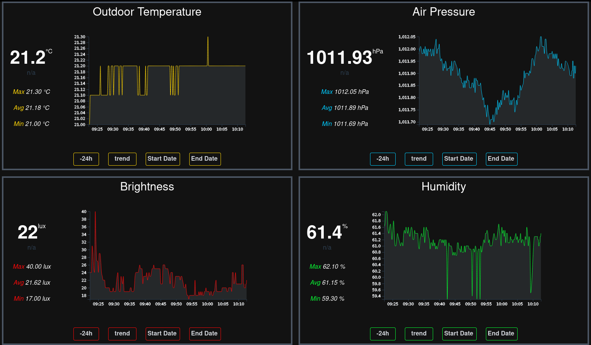

# Webapplication frontend for a Raspberry Pi 4 weatherstation

# What it does
This application is written in JavaScript / VueJS and will be acting as a full featured weather station running in the web browser.
The main features are display current measurements, peak values (*min*, *max*, *avg*) and a special feature is the possibility to watch long-term data.
The graphical visualization is done with the javascript library d3.

# Preview

# Progress

## Implemented
* Watch current values
* Watch peak values
* Graphical data visualization of the past three hours

## Todo
* Customize the visible history time range
* Calculating forecast values based on air pressure

# Annotations
This application does not run stand alone and depends from [APIServer] and [Sensordrivers]

[APIServer]: https://github.com/wolfbiker1/weatherStationAPIServer (APIServer)
[Sensordrivers]: https://github.com/wolfbiker1/sensorDrivers (Sensordrivers)